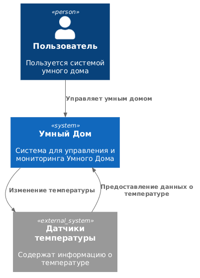
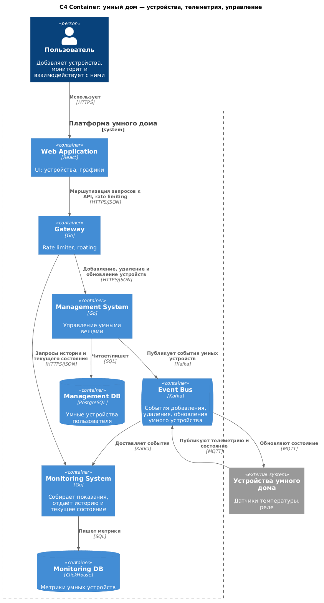
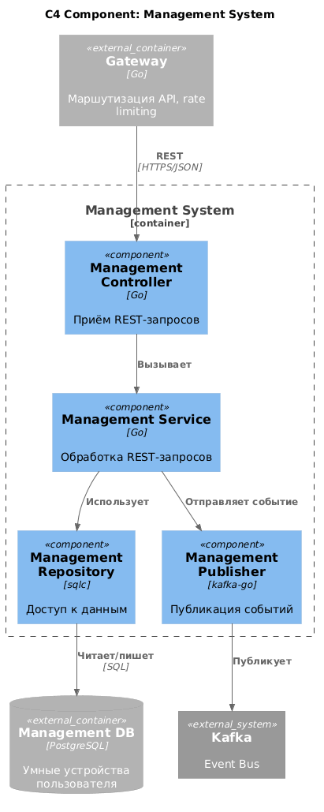
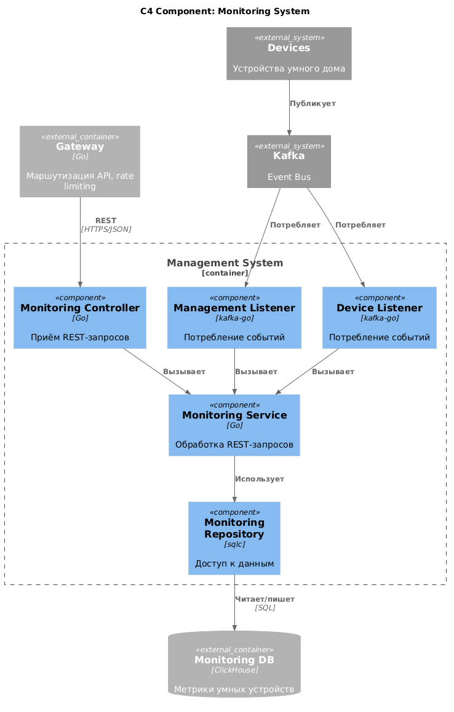
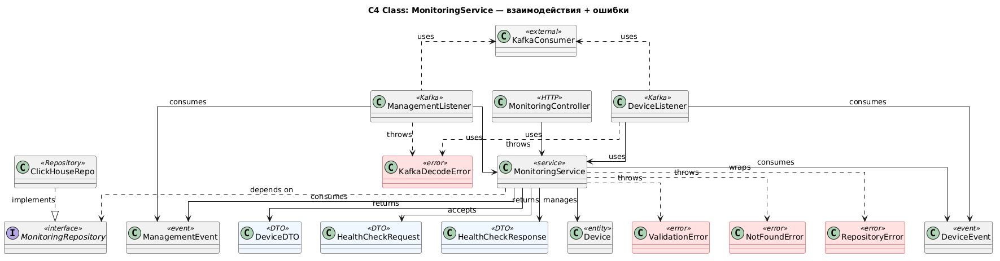
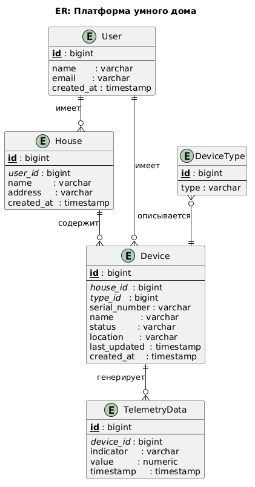

# Project_template

Это шаблон для решения проектной работы. Структура этого файла повторяет структуру заданий. Заполняйте его по мере работы над решением.

# Задание 1. Анализ и планирование

<aside>

Чтобы составить документ с описанием текущей архитектуры приложения, можно часть информации взять из описания компании и условия задания. Это нормально.

</aside>

### 1. Описание функциональности монолитного приложения

**Управление отоплением:**

- Пользователи могу удалённо включать/выключать отопление в своих домах.
- Система поддерживает метод API: ``PATCH /api/v1/sensors/:id/value - Update a sensor's value and status``
- Система поддерживает метод API: ``POST /api/v1/sensors - Create a new sensor``
- Система поддерживает метод API: ``PUT /api/v1/sensors/:id - Update a sensor``
- Система поддерживает метод API: ``DELETE /api/v1/sensors/:id - Delete a sensor``
- Т.e. система поддерживает создание, обновление, частичное обновление и удаление сенсоров температуры.

**Мониторинг температуры:**

- Пользователи могут просматривать текущую температуру в своих домах через веб-интерфейс
- Система поддерживает получение данных о температуре с датчиков, установленных в домах. 
- Система поддерживает метод API:  ``GET /api/v1/sensors - Get all sensors``
- Система поддерживает метод API: ``GET /api/v1/sensors/:id - Get a specific sensor``
- Система поддерживает метод API: ``GET /health - Health check``
- Т.е. система поддерживает получение информации о здоровье системы (мониторинг), получение инфорации о сенсоре/ специфик сенсоре

### 2. Анализ архитектуры монолитного приложения

Перечислите здесь основные особенности текущего приложения: какой язык программирования используется, какая база данных, как организовано взаимодействие между компонентами и так далее.

- **Язык программирования**: Go
- **База данных**: PostgreSQL
- **Архитектура**: Монолитная, все компоненты системы (обработка запросов, бизнес-логика, работа с данными) находятся в рамках одного приложения.
- **Взаимодействие**: Синхронное, запросы обрабатываются последовательно.
- **Масштабируемость**: Ограничена, так как монолит сложно масштабировать по частям.
- **Развертывание**: Требует остановки всего приложения.

### 3. Определение доменов и границы контекстов

- Домен: Система Управления
- Домен: Система Мониторинга

### **4. Проблемы монолитного решения**

- **Сложность последующей разработки и тестирования**: команда будет разделена на разработку и поддержку модулей; общая кодовая база затрудит этот процесс
- **Медленные деливери**: с ростом числа пользователей и развитием продукта командам придется все больше добавлять функциональностей в свои модули, катить их в прод. 
Монолит в данном случае - рост TTM (time to market)
- **Сложность развертывания и маслтабирования**: команда не сможет поскейлить конкретный компонент системы, не сможет быстро совершить миграцию в облаке тротялящего сервиса
Рост пользователей и нагрузки неибежно приведет к проблемам с инфрой, который в данном случае будет проблемно решить (скейлить весь монолит, долго мигрировать из-за большого докер образа и тд)

### 5. Визуализация контекста системы — диаграмма С4

Добавьте сюда диаграмму контекста в модели C4.



# Задание 2. Проектирование микросервисной архитектуры

В этом задании вам нужно предоставить только диаграммы в модели C4. Мы не просим вас отдельно описывать получившиеся микросервисы и то, как вы определили взаимодействия между компонентами To-Be системы. Если вы правильно подготовите диаграммы C4, они и так это покажут.

**Диаграмма контейнеров (Containers)**



**Диаграмма компонентов (Components)**

*Диаграмма компонентов ManagementSystem*



*Диаграмма компонентов MonitoringSystem*



**Диаграмма кода (Code)**



# Задание 3. Разработка ER-диаграммы



# Задание 4. Создание и документирование API

### 1. Тип API

Считаю, что целесообразно использовать как openAPI, так и asyncAPI для разных взаимодействий.

Примеры:
- CRUD с датчиками - классический синхронный REST
- Получение хелсчека умного дома - REST
- Изменение температуры - async через kafka; система не ждет того, что на датчике поменяется температура.

Таким образом, мы используем и asyncAPI, и openAPI. 

### 2. Документация API

[OpenAPI Documentation](https://devsmike.github.io/architecture-warmhouse/open_api_html/openApi.html)

[AsyncAPI Documentation](https://devsmike.github.io/architecture-warmhouse/async_api_html/index.html)

# Задание 5. Работа с docker и docker-compose

**Ответ**: реализованный docker compose: [docker-compose](apps/docker-compose.yml)

**Задание**:

Перейдите в apps.

Там находится приложение-монолит для работы с датчиками температуры. В README.md описано как запустить решение.

Вам нужно:

1) сделать простое приложение temperature-api на любом удобном для вас языке программирования, которое при запросе /temperature?location= будет отдавать рандомное значение температуры.

Locations - название комнаты, sensorId - идентификатор названия комнаты

```
	// If no location is provided, use a default based on sensor ID
	if location == "" {
		switch sensorID {
		case "1":
			location = "Living Room"
		case "2":
			location = "Bedroom"
		case "3":
			location = "Kitchen"
		default:
			location = "Unknown"
		}
	}

	// If no sensor ID is provided, generate one based on location
	if sensorID == "" {
		switch location {
		case "Living Room":
			sensorID = "1"
		case "Bedroom":
			sensorID = "2"
		case "Kitchen":
			sensorID = "3"
		default:
			sensorID = "0"
		}
	}
```

2) Приложение следует упаковать в Docker и добавить в docker-compose. Порт по умолчанию должен быть 8081

3) Кроме того для smart_home приложения требуется база данных - добавьте в docker-compose файл настройки для запуска postgres с указанием скрипта инициализации ./smart_home/init.sql

Для проверки можно использовать Postman коллекцию smarthome-api.postman_collection.json и вызвать:

- Create Sensor
- Get All Sensors

Должно при каждом вызове отображаться разное значение температуры

Ревьюер будет проверять точно так же.


